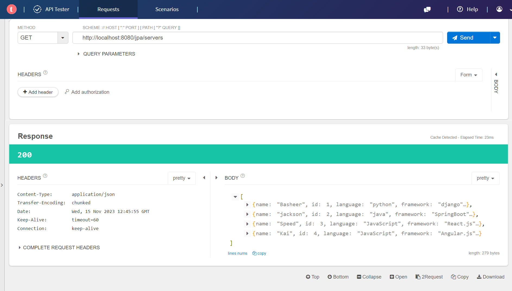
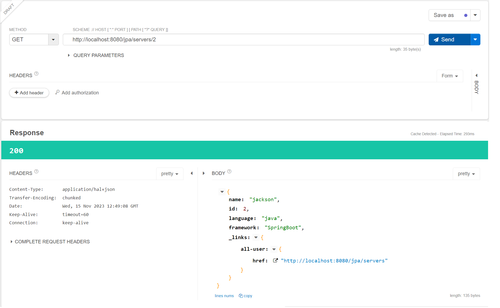
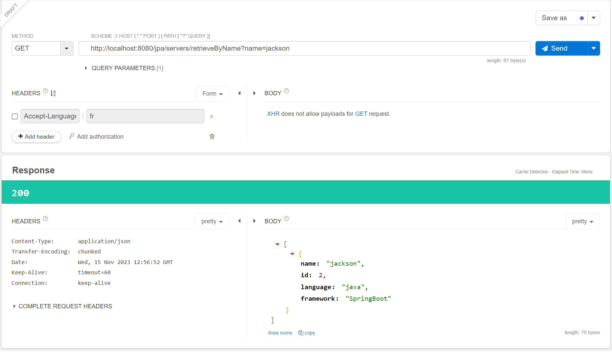
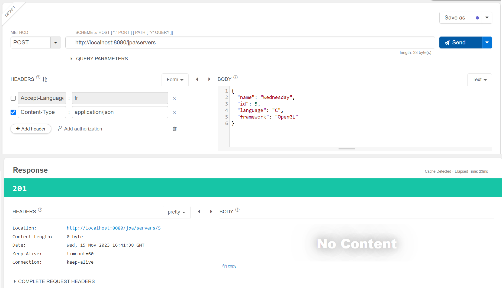
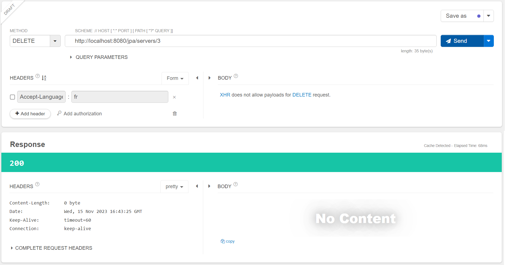
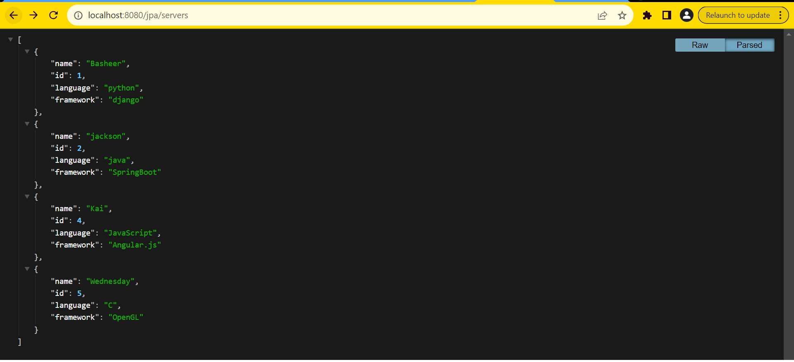

# Java REST API Example

This project implements a simple Java REST API for managing "server" objects using Spring Boot and MongoDB.

## Table of Contents

- [Introduction](#introduction)
- [Features](#features)
- [Technologies Used](#technologies-used)
- [Getting Started](#getting-started)
  - [Prerequisites](#prerequisites)
  - [Installation](#installation)
  - [Configuration](#configuration))
  - [API Endpoints](#api-endpoints)
- [Testing](#testing)


## Introduction

This project provides a Java REST API for performing CRUD operations on "server" objects. Servers are stored in a MongoDB database.

## Features

- **GET Servers:** Retrieve all servers or a single server by ID.
- **PUT Server:** Add a new server.
- **DELETE Server:** Delete a server by ID.
- **GET Servers by Name:** Find servers containing a specific string in their name.
- **GET Servers by Name (New):** Retrieve servers by name using the `retrieveByName` API.

## Technologies Used

- Java
- Spring Boot
- MongoDB

## Getting Started

### Prerequisites

- Java (version 8 or later)
- MongoDB installed and running

### Installation

1. Clone the repository.
2. Build the project using your preferred build tool (e.g., Maven or Gradle).

### Configuration

Configure the application properties, especially the MongoDB connection details, in `application.properties`.


### API Endpoints

- **GET /jpa/servers:** Retrieve all servers or a single server by ID.
- **GET /jpa/servers/{id}:** Retrieve a server by ID.
- **GET /jpa/servers/retrieveByName:** Retrieve servers by name.
- **POST /jpa/servers:** Add a new server.
- **DELETE /jpa/servers/{id}:** Delete a server by ID.

##Testing
Test 1: Retrieve all servers (GET Method)

```
	http://localhost:8080/jpa/servers
```

 

Test 2: Retrieve servers By Id (GET Method)

```
	http://localhost:8080/jpa/servers/2
```
 

Test 3: Retrieve servers By Name (GET Method)

```
	http://localhost:8080/jpa/servers/retrieveByName?name=jackson
```
 

Test 4: Create a new Server (POST Method)

```
	http://localhost:8080/jpa/servers
```
 

Test 5: Delete servers By Id (DELETE Method)

```
	http://localhost:8080/jpa/servers/retrieveByName?name=jackson
```
 

#####Final Server List 
 
